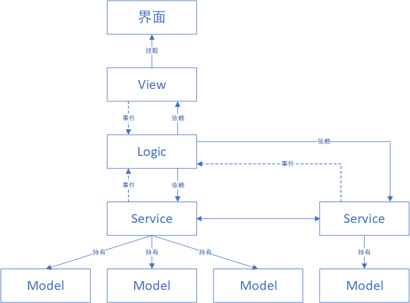

# LitMVC
适用于unity的超轻量级MVC框架   
可以用于中小型项目快速开发UI系统的基本框架结构。
## 结构

#### 界面
一个unity预制体，它可以被放置在任何地方，子节点名字中包含有_的可以被工具识别并自动生成代码并绑定。
#### View
由工具生成的界面绑定脚本，由工具生成后自动绑定到预制体上，每次调用工具都会重新生成。继承UIView脚本。
#### Logic
由工具生成的界面逻辑脚本，由工具生成，只生成不刷新。在这里写逻辑代码，继承UIView，可以使用MonoBehaviour提供的功能。
通过依赖调用Service层，同时接收事件。Logic之间尽量不互相耦合，利用事件系统或用Service为中介进行通讯
#### Service
业务逻辑脚本，建议使用单例模式，建议通过事件去响应Logic以减少耦合，如需多种实现可以酌情增加一层接口层供解耦合。
该脚本持有数据，可以依赖其他Service脚本
#### Model
数据层，建议使用单例模式，持有和加载数据，dataModel可以放置在任意位置，需自行编写加载逻辑。

## 工具
在预制体上点选CreateUIView选项自动生成View和Logic脚本 
如果发生路径错误的问题，请尝试点选Config文件的“自动填充”按钮